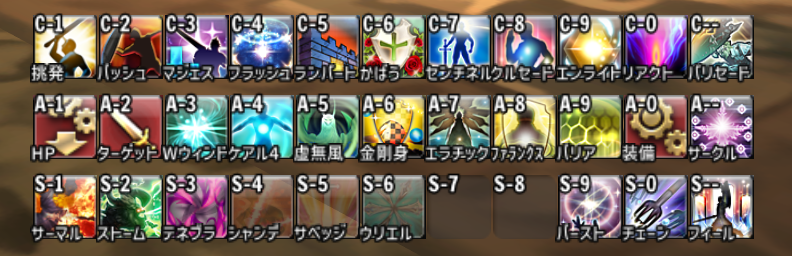

## XIVHotbar2'

Technyzeさん作の[XIVHotbar2](https://github.com/Technyze/XIVHotbar2)[^1]を以下のように改変したバージョンです。

- 毎フレームごとの処理を簡略化し、アイドル状態でのCPU使用率を軽減
- 日本語対応（ホットバー定義でアビ名や魔法名などを日本語名で指定可能）
- 全キャラ共通のホットバー定義ファイルを読み込めるようにした  
`data/キャラ名/ジョブ名.lua`を優先的に読みますが、それが存在しない場合には `data/ジョブ名.lua`を読み込みます。
- ホットバーアイコンの枠を描画しないオプションを追加  
settings.xml > Hotbar > HideSlotFrame をtrueにすると枠が描画されません。
- HorizonXIサーバ用モードを削除  
（Windower純正のリソースファイルのみを利用するようにしたかったため）
- その他細かな修正

使い方については[XIVHotbar2](https://github.com/Technyze/XIVHotbar2)のREADMEなどを参照してください。

ホットバー定義のサンプルとして、`data/PLD.lua`が格納されています。

[^1]: さらに元となるのは [xivhotbar](https://github.com/SirEdeonX/FFXIAddons/tree/master/xivhotbar)(SirEdeonXさん) と [XIVHotbar - \[Version 0.5\]](https://github.com/Akirane/XIVHotbar)(Akiraneさん)
